# 用例图 — 旅游业务管理系统

```mermaid
graph TB
    subgraph "旅游业务管理系统"
        subgraph "申请管理"
            UC1(查询旅游团)
            UC2(办理旅游申请)
            UC3(计算订金)
            UC4(记录订金支付)
            UC5(打印收据和申请书)
            UC6(录入参加者信息)
        end

        subgraph "催款与余款"
            UC7(打印旅游确认书)
            UC8(打印余额交款单)
            UC9(装信封邮寄)
            UC10(查询申请信息)
            UC11(录入余款支付)
        end

        subgraph "取消与变更"
            UC12(变更参加者信息)
            UC13(取消参加者)
            UC14(取消整个申请)
            UC15(计算取消手续费)
            UC16(选定新责任人)
        end

        subgraph "路线与活动管理"
            UC17(设计旅游路线)
            UC18(设定旅游活动)
            UC19(录入新路线和新活动)
            UC20(取消旅游线路)
            UC21(调整活动价格)
            UC22(公开旅游价格)
        end

        subgraph "系统后台"
            UC23(每日导出财务数据)
        end
    end

    A1[前台接待员工] --> UC1
    A1 --> UC2
    A1 --> UC3
    A1 --> UC4
    A1 --> UC5
    A1 --> UC6
    A1 --> UC10
    A1 --> UC11
    A1 --> UC12
    A1 --> UC13
    A1 --> UC14
    A1 --> UC15
    A1 --> UC16

    A2[催款员工] --> UC7
    A2 --> UC8
    A2 --> UC9

    A3[路线管理员工] --> UC17
    A3 --> UC18
    A3 --> UC19
    A3 --> UC20
    A3 --> UC21
    A3 --> UC22

    A4[系统定时任务] --> UC23

    A5[会计人员] -.->|使用| FS[财务系统]
    UC23 -.->|导出到| FS
```

## 角色说明

| 角色 | 说明 |
|------|------|
| 前台接待员工 | 主要操作者，负责接待顾客、办理申请、收付款、变更取消等 |
| 催款员工 | 每日打印确认书和交款单，邮寄给申请责任人 |
| 路线管理员工 | 每季度设计和维护旅游路线、活动及价格 |
| 会计人员 | 在外部财务系统中处理导出的现金数据 |
| 系统定时任务 | 每晚自动导出财务数据 |
