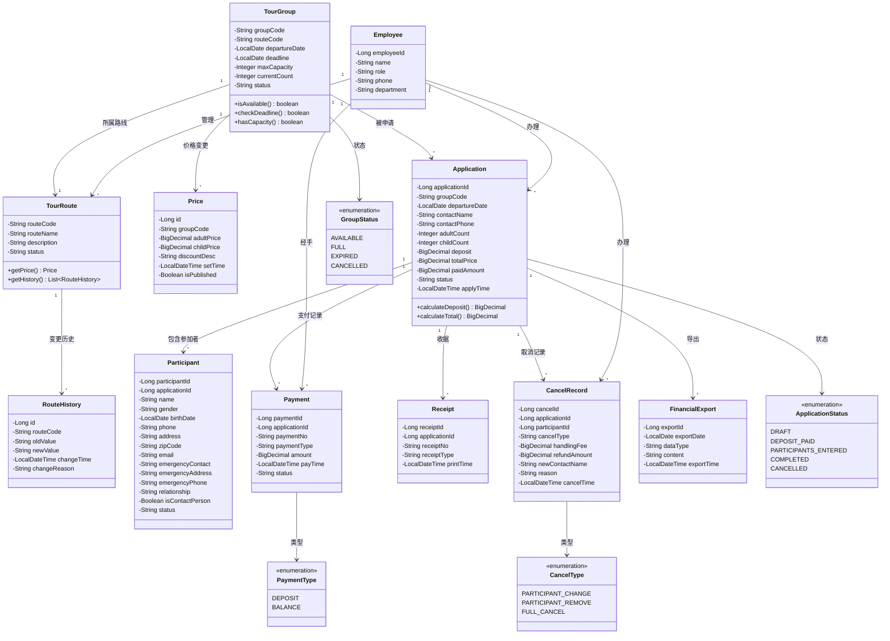

# 类图 — 旅游业务管理系统

## 核心类职责

| 类 | 职责 |
|----|------|
| **TourRoute** | 旅游路线，支持版本变更历史，状态变更（非删除） |
| **TourGroup** | 旅游团，校验截止日期和人数限额 |
| **Application** | 旅游申请，计算订金、总价，管理参加者 |
| **Participant** | 参加者信息，含紧急联系人 |
| **Payment** | 支付记录（订金/余款） |
| **Receipt** | 收据和确认书打印记录 |
| **CancelRecord** | 取消/变更记录，含手续费计算 |
| **Price** | 旅游团价格，可多次设定，公开后不可变更 |
| **FinancialExport** | 每日财务数据导出 |
