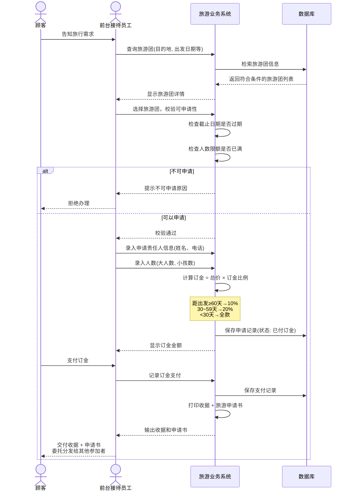
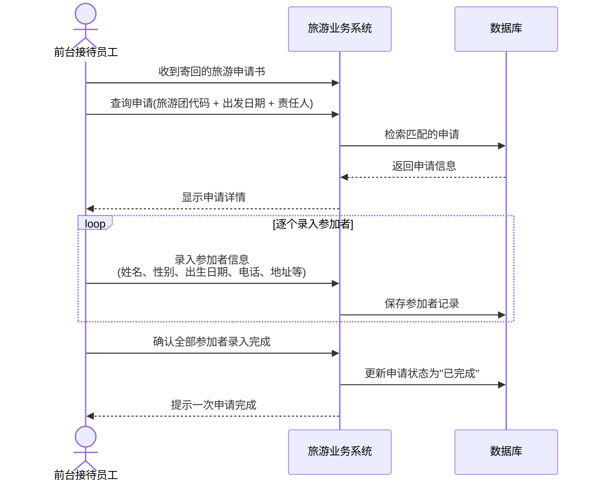
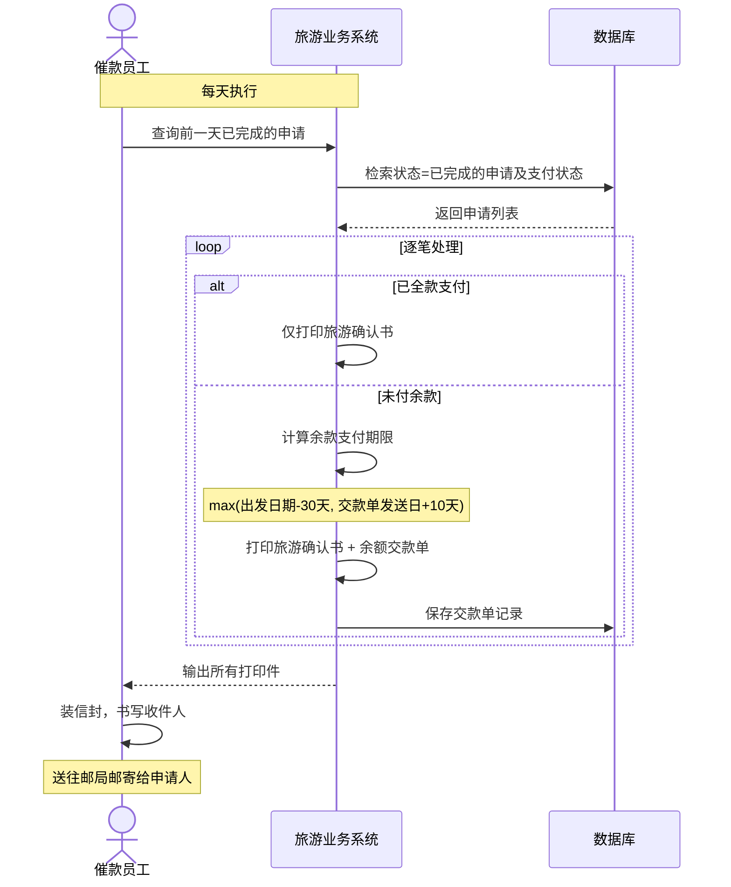
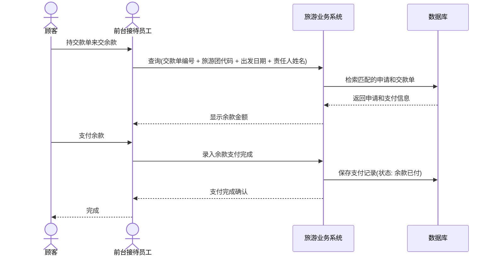
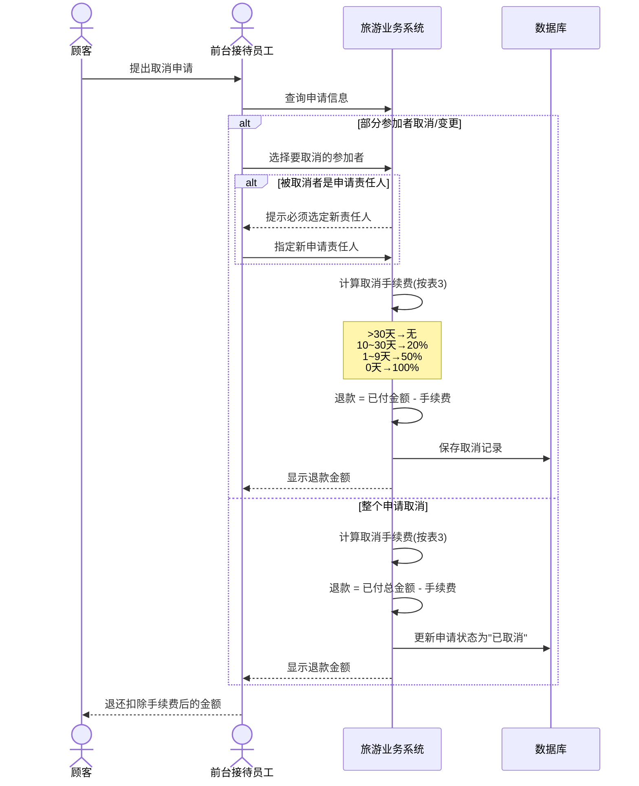
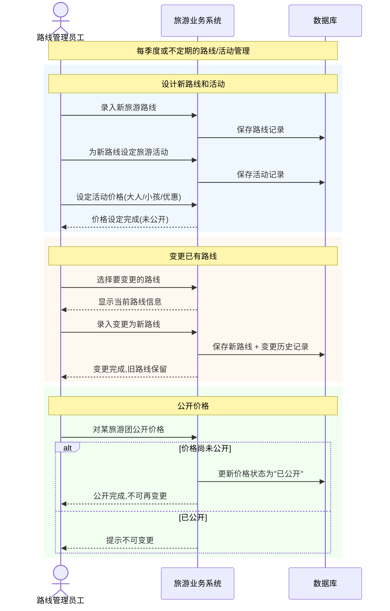
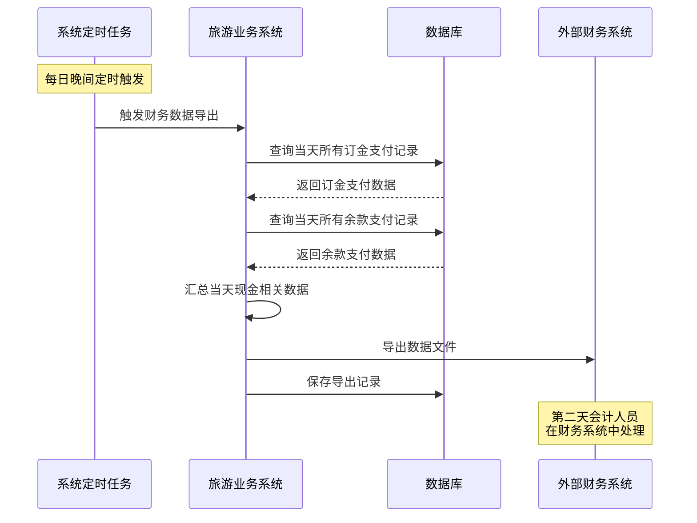

# 时序图 — 旅游业务管理系统

## 1. 旅游申请办理流程

```mermaid
sequenceDiagram
    actor Customer as 顾客
    actor Staff as 前台接待员工
    participant System as 旅游业务系统
    participant DB as 数据库

    Customer->>Staff: 告知旅行需求
    Staff->>System: 查询旅游团(目的地, 出发日期等)
    System->>DB: 检索旅游团信息
    DB-->>System: 返回符合条件的旅游团列表
    System-->>Staff: 显示旅游团详情

    Staff->>System: 选择旅游团，校验可申请性
    System->>System: 检查截止日期是否过期
    System->>System: 检查人数限额是否已满
    alt 不可申请
        System-->>Staff: 提示不可申请原因
        Staff-->>Customer: 拒绝办理
    else 可以申请
        System-->>Staff: 校验通过

        Staff->>System: 录入申请责任人信息(姓名、电话)
        Staff->>System: 录入人数(大人数, 小孩数)
        System->>System: 计算订金 = 总价 × 订金比例
        Note over System: 距出发≥60天→10%<br>30~59天→20%<br><30天→全款
        System->>DB: 保存申请记录(状态: 已付订金)
        System-->>Staff: 显示订金金额

        Customer->>Staff: 支付订金
        Staff->>System: 记录订金支付
        System->>DB: 保存支付记录
        System->>System: 打印收据 + 旅游申请书
        System-->>Staff: 输出收据和申请书
        Staff-->>Customer: 交付收据 + 申请书<br>委托分发给其他参加者
    end
```

## 2. 参加者信息录入流程

```mermaid
sequenceDiagram
    actor Staff as 前台接待员工
    participant System as 旅游业务系统
    participant DB as 数据库

    Staff->>System: 收到寄回的旅游申请书
    Staff->>System: 查询申请(旅游团代码 + 出发日期 + 责任人)
    System->>DB: 检索匹配的申请
    DB-->>System: 返回申请信息
    System-->>Staff: 显示申请详情

    loop 逐个录入参加者
        Staff->>System: 录入参加者信息<br>(姓名、性别、出生日期、电话、地址等)
        System->>DB: 保存参加者记录
    end

    Staff->>System: 确认全部参加者录入完成
    System->>DB: 更新申请状态为"已完成"
    System-->>Staff: 提示一次申请完成
```

## 3. 每日催款流程

```mermaid
sequenceDiagram
    actor Collector as 催款员工
    participant System as 旅游业务系统
    participant DB as 数据库

    Note over Collector,System: 每天执行

    Collector->>System: 查询前一天已完成的申请
    System->>DB: 检索状态=已完成的申请及支付状态
    DB-->>System: 返回申请列表

    loop 逐笔处理
        alt 已全款支付
            System->>System: 仅打印旅游确认书
        else 未付余款
            System->>System: 计算余款支付期限
            Note over System: max(出发日期-30天, 交款单发送日+10天)
            System->>System: 打印旅游确认书 + 余额交款单
            System->>DB: 保存交款单记录
        end
    end

    System-->>Collector: 输出所有打印件
    Collector->>Collector: 装信封，书写收件人
    Note over Collector: 送往邮局邮寄给申请人
```

## 4. 余款支付流程

```mermaid
sequenceDiagram
    actor Customer as 顾客
    actor Staff as 前台接待员工
    participant System as 旅游业务系统
    participant DB as 数据库

    Customer->>Staff: 持交款单来交余款
    Staff->>System: 查询(交款单编号 + 旅游团代码 + 出发日期 + 责任人姓名)
    System->>DB: 检索匹配的申请和交款单
    DB-->>System: 返回申请和支付信息
    System-->>Staff: 显示余款金额

    Customer->>Staff: 支付余款
    Staff->>System: 录入余款支付完成
    System->>DB: 保存支付记录(状态: 余款已付)
    System-->>Staff: 支付完成确认
    Staff-->>Customer: 完成
```

## 5. 取消申请流程

```mermaid
sequenceDiagram
    actor Customer as 顾客
    actor Staff as 前台接待员工
    participant System as 旅游业务系统
    participant DB as 数据库

    Customer->>Staff: 提出取消申请
    Staff->>System: 查询申请信息

    alt 部分参加者取消/变更
        Staff->>System: 选择要取消的参加者
        alt 被取消者是申请责任人
            System-->>Staff: 提示必须选定新责任人
            Staff->>System: 指定新申请责任人
        end
        System->>System: 计算取消手续费(按表3)
        Note over System: >30天→无<br>10~30天→20%<br>1~9天→50%<br>0天→100%
        System->>System: 退款 = 已付金额 - 手续费
        System->>DB: 保存取消记录
        System-->>Staff: 显示退款金额

    else 整个申请取消
        System->>System: 计算取消手续费(按表3)
        System->>System: 退款 = 已付总金额 - 手续费
        System->>DB: 更新申请状态为"已取消"
        System-->>Staff: 显示退款金额
    end

    Staff-->>Customer: 退还扣除手续费后的金额
```

## 6. 路线与价格管理流程

```mermaid
sequenceDiagram
    actor Manager as 路线管理员工
    participant System as 旅游业务系统
    participant DB as 数据库

    Note over Manager,DB: 每季度或不定期的路线/活动管理

    rect rgb(240, 248, 255)
        Note over Manager,DB: 设计新路线和活动
        Manager->>System: 录入新旅游路线
        System->>DB: 保存路线记录
        Manager->>System: 为新路线设定旅游活动
        System->>DB: 保存活动记录
        Manager->>System: 设定活动价格(大人/小孩/优惠)
        System-->>Manager: 价格设定完成(未公开)
    end

    rect rgb(255, 248, 240)
        Note over Manager,DB: 变更已有路线
        Manager->>System: 选择要变更的路线
        System-->>Manager: 显示当前路线信息
        Manager->>System: 录入变更为新路线
        System->>DB: 保存新路线 + 变更历史记录
        System-->>Manager: 变更完成,旧路线保留
    end

    rect rgb(240, 255, 240)
        Note over Manager,DB: 公开价格
        Manager->>System: 对某旅游团公开价格
        alt 价格尚未公开
            System->>DB: 更新价格状态为"已公开"
            System-->>Manager: 公开完成,不可再变更
        else 已公开
            System-->>Manager: 提示不可变更
        end
    end
```

## 7. 每日财务数据导出

```mermaid
sequenceDiagram
    participant Scheduler as 系统定时任务
    participant System as 旅游业务系统
    participant DB as 数据库
    participant Finance as 外部财务系统

    Note over Scheduler: 每日晚间定时触发

    Scheduler->>System: 触发财务数据导出
    System->>DB: 查询当天所有订金支付记录
    DB-->>System: 返回订金支付数据
    System->>DB: 查询当天所有余款支付记录
    DB-->>System: 返回余款支付数据
    System->>System: 汇总当天现金相关数据
    System->>Finance: 导出数据文件
    System->>DB: 保存导出记录
    Note over Finance: 第二天会计人员<br>在财务系统中处理
```
