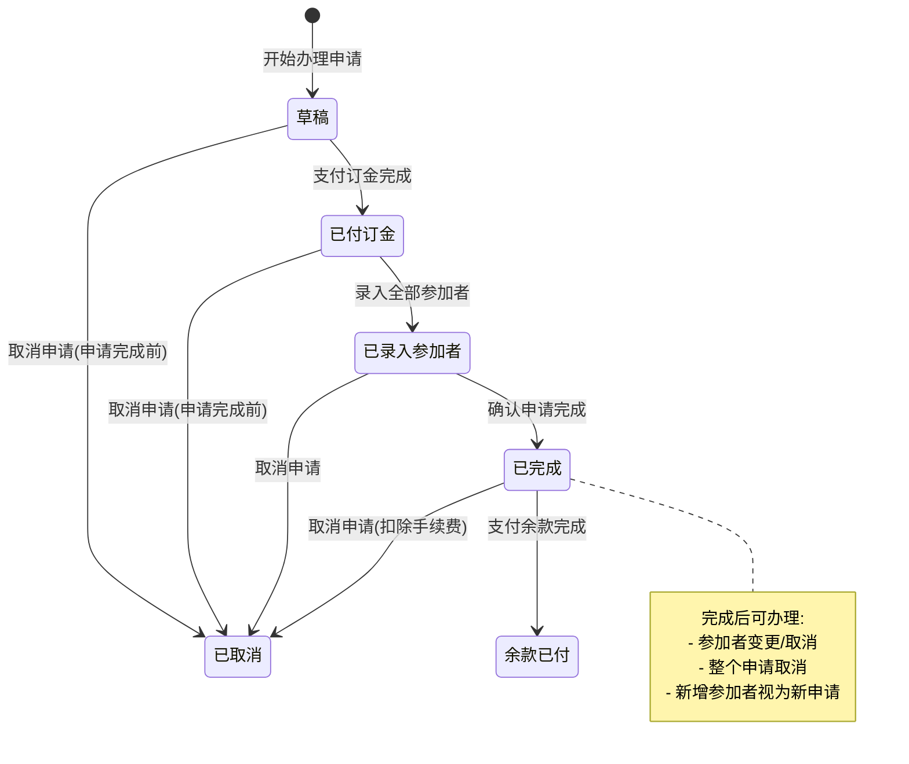
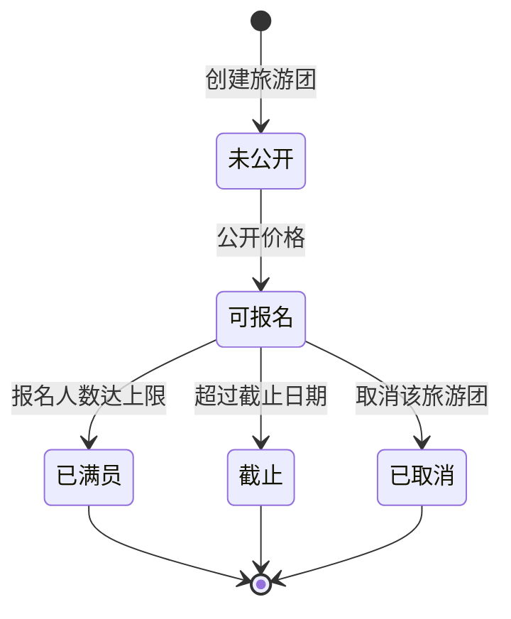
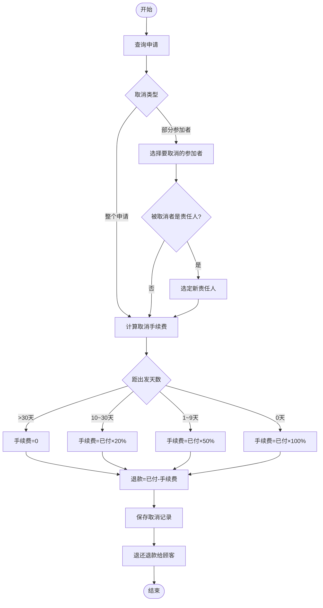

# 状态图与活动图 — 旅游业务管理系统

## 1. 申请状态图



## 2. 旅游团状态图



## 3. 申请办理活动图

```mermaid
graph TD
    A([开始]) --> B[查询旅游团]
    B --> C{截止日期检查}
    C -->|已过期| D[提示不可申请]
    C -->|未过期| E{人数限额检查}
    E -->|已满| D
    E -->|有空位| F[录入责任人姓名和电话]
    F --> G[录入大人和小孩人数]
    G --> H[计算订金]
    H --> I{距出发天数}
    I -->|≥60天| J[订金 = 总价×10%]
    I -->|30~59天| K[订金 = 总价×20%]
    I -->|<30天| L[订金 = 总价(全款)]
    J --> M[录入订金支付]
    K --> M
    L --> M
    M --> N[打印收据和申请书]
    N --> O[交付给顾客]
    O --> P([结束])
    D --> P
```

## 4. 取消申请活动图


