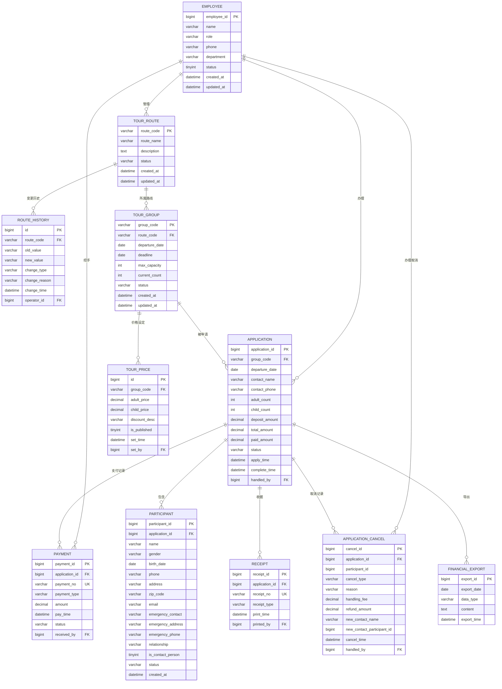

# ER 图 — 旅游业务管理系统



## 实体关系说明

| 关系 | 类型 | 说明 |
|------|------|------|
| TOUR_ROUTE → ROUTE_HISTORY | 1:N | 一条路线有多条变更历史 |
| TOUR_ROUTE → TOUR_GROUP | 1:N | 一条路线下可有多个旅游团 |
| TOUR_GROUP → TOUR_PRICE | 1:N | 一个旅游团价格可多次设定 |
| TOUR_GROUP → APPLICATION | 1:N | 一个旅游团可被多次申请 |
| APPLICATION → PARTICIPANT | 1:N | 一个申请包含多个参加者 |
| APPLICATION → PAYMENT | 1:N | 一个申请有多笔支付(订金+余款) |
| APPLICATION → RECEIPT | 1:N | 一个申请有多张收据/确认书 |
| APPLICATION → APPLICATION_CANCEL | 1:N | 一个申请可有多次取消/变更 |
```
